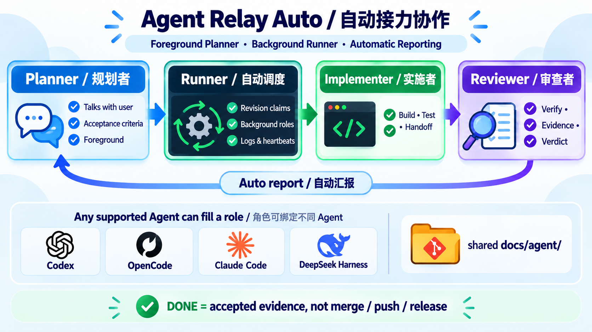
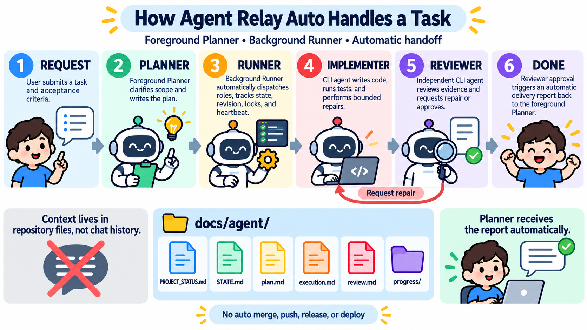

# Agent Relay Auto

> A protocol-driven orchestration framework for reliable multi-Agent collaboration, durable context handoff, and automated delivery across Codex, OpenCode, Claude Code, and more.

[简体中文](README.zh-CN.md) · [Project introduction](docs/PROJECT_INTRO.en-US.md) · [Full usage guide](docs/AGENT_RELAY_AUTO_USAGE.en-US.md) · [Latest release](https://github.com/MJHuang666/agent-relay-auto/releases/latest)

## The idea in one sentence

Agent Relay Auto is a lightweight multi-Agent collaboration framework for durable, file-based work across one project repository.

Agent Relay Auto does not ask different Agents to share one chat context. It gives them one durable project state. Requirements, plans, decisions, implementation evidence, review conclusions, handoffs, and final reports live in repository files, so the project can survive a model change, a new Agent, a closed chat window, or a migrated machine.

In automatic mode, the user talks only to the foreground Planner. Runner claims and launches the Implementer and Reviewer in the background; after a valid review, it resumes the exact registered Planner conversation, which summarizes delivery and completes DONE:

~~~text
User ↔ foreground Planner
          │
          ▼
     requirements + plan
          │
          ▼
background Runner ──► Implementer ──► Reviewer
       ▲                                  │
       └──── automatic repair / re-plan ──┘
                                          │
                                          ▼
                           original Planner conversation
                                  receives the report
                                          │
                                          ▼
                                         DONE
~~~

REPORTING does not require the user to type continue again. The default project polling interval is 45 seconds. WAITING_USER, BLOCKED, and scope expansion return to the foreground for a user decision.

## The core principle: project cognition must outlive the Agent

A single chat is not a dependable long-term engineering record. Context can be truncated, models can change, an Agent can run out of quota, and machines or environments can be replaced. Durable understanding belongs to the project.

~~~text
Temporary chat context                    Durable project cognition
one window · one model · one machine  ──► repository files · Git history · evidence
                                             │
                                             ▼
                                  any compatible Agent can resume
~~~

## Three stable roles, freely composable tools

Roles are stable contracts; tools are replaceable execution surfaces. One tool may serve several roles, and a role may move between tools without losing shared state.

| Role | Owns | Boundary |
|---|---|---|
| **Planner** | Requirements, scope, non-goals, plans, decisions, and acceptance criteria | Does not edit product code; asks the user when requirements are ambiguous or scope expands |
| **Implementer** | Code, tests, execution evidence, and Reviewer rework | Does not self-approve delivery; must record USE or DO_NOT_USE for subagents before implementation |
| **Reviewer** | Independent review, verification, and the completion decision | Does not directly repair product code; a pass requires evidence |

The standard automatic loop:

~~~text
Planner writes plan.md
    ↓
Runner launches Implementer
    ↓
Implementer writes execution.md + test evidence
    ↓
Runner launches Reviewer
    ├─ PASS              → original Planner report → DONE
    ├─ CHANGES_REQUESTED → Implementer rework → review again
    ├─ REPLAN_REQUIRED   → Planner returns to the foreground
    └─ BLOCKED / WAITING_USER → user action required
~~~

## What the framework provides

| Capability | Meaning |
|---|---|
| File-based context | docs/agent/ is the shared cognition layer across Agents, models, and machines |
| Automatic handoff | Runner starts the next role only after a legal state transition |
| Original Planner reporting | Reviewer PASS resumes the Planner conversation registered during initialization |
| Project isolation | Different projects run in parallel; the first release serializes one active task and one role turn per project |
| Safe coordination | task_id + revision + participant_id + lock prevent stale sessions from overwriting state |
| Recovery | Interruptions, timeouts, and Runner restarts recover from durable state, heartbeats, and run records |
| Auditable delivery | Reviewer evidence, delivery IDs, reports, and final state stay in the task directory |
| Agent replacement | Same-role A → B → A switching is repeatable and preserves immutable identities and reasons |

## Supported Agents

Initialization assigns a stable Tool ID to each role:

| Option | Tool ID | Automatic-mode note |
|---|---|---|
| Codex | codex | Background implementation, review, and Planner reporting |
| Cursor | cursor | File-based relay; not used for original-window wake in this release |
| Claude Code | claude-code | Non-interactive background adapter; first launch validates credentials and model |
| WorkBuddy | workbuddy | File-based relay |
| ZCode | zcode | File-based relay |
| Trae | trae | File-based relay |
| DeepSeek Harness | deepseek-harness | Planner wake is truthfully labeled static_only or experimental |
| OpenCode | opencode | Non-interactive background adapter and Planner reporting; first launch validates |
| Other | user-defined stable ID | Falls back to the manual relay according to its capabilities |

OpenCode and DeepSeek Harness reuse the root AGENTS.md, .agents/skills/agent-relay-auto/, and docs/agent/. Do not create duplicate .opencode/skills or .dsh/skills protocol trees.

## From zero to automatic execution

### 0. Prerequisites

- Run initialization from the target project root; never initialize a parent directory or the Skill source tree.
- Git is recommended so reviewed delivery can be tied to a version and diff.
- Python 3 enables the short-lived file lock, revision CAS, and atomic-write helper. Without Python 3, manual serial relay still works with an explicit degraded-safety notice.
- The automatic Runner currently uses macOS launchd. Each CLI Agent must already be authenticated and able to run its selected model.

### 1. Install the Skill

Choose one:

1. Install the release package's shared/.agents/skills/agent-relay-auto/ into the current tool's personal Skills directory.
2. Download the Skill package from GitHub Releases and merge it according to distribution/INSTALL.md.

After installation, execute the initialization command in the Planner conversation for the target project. Initialization copies the project-local template and shared protocol; users do not need to locate or configure an “Adapter factory”.

### 2. Initialize the current repository

Open the Planner conversation at the project root and enter:

~~~text
$agent-relay-auto initialize this repository
# or
$agent-relay-auto 初始化当前仓库
~~~

Initialization fills missing collaboration files only. It does not overwrite product code, existing tasks, participant bindings, or project rules.

### 3. Choose the project language first

The Skill asks for exactly one:

1. English (en-US)
2. 中文 (zh-CN)

The selection is written to docs/agent/PROJECT_STATUS.md and controls subsequent choices, requirements, plans, execution records, reviews, and acceptance reports. Protocol keys and status enums remain stable.

### 4. Select the Agent and identity for each role

Choose the Agent for Planner, Implementer, and Reviewer, then confirm a unique participant_id for each. All three roles may use Codex, or they may be distributed across Codex, OpenCode, Claude Code, and other tools.

If the project already has a configuration, the Skill shows the complete table and offers Confirm or Modify. It never infers identity from whichever tool happens to be open.

### 5. Configure models, reasoning, and automatic policy

For every role, the conversational setup confirms:

- participant_id
- Agent Tool ID
- model ID
- provider-specific reasoning: Codex uses reasoning_effort, OpenCode uses variant, and Claude Code uses effort

The initializer shows these defaults before asking for changes:

| Setting | Default |
|---|---:|
| Maximum rework rounds | 3 |
| Maximum automatic replans | 1 |
| Agent failure retries | 1 |
| Same-role backup Agent fallback | Off |
| Cost control | balanced (warn after run 8; stop new runs after run 12) |

Runner will not start with missing participants, placeholder models, unsupported automatic tools, or an unregistered Planner conversation. The Skill reports the exact missing field and guides the user through configuration.

### 6. Separately confirm Runner installation and startup

After configuration, the Skill presents one final three-role summary and separately asks whether to install and start the project Runner.

- Choose No to keep the project in manual mode and use file-based handoffs.
- Choose Yes to require ready_to_start: true, install the versioned Runner, register the project, and start the macOS launchd service.

The Runner uses the Planner conversation registered during initialization as the only final-report channel. The binding is stored in the ignored file .agent-relay-auto/planner-channel.json; status output masks the conversation ID.

### 7. Verify that automation is live

From the Planner conversation, check:

~~~text
$agent-relay-auto runner status
# or
$agent-relay-auto Runner 状态
~~~

The project should be registered, complete, and attached to a loaded service. For diagnostics:

~~~text
$agent-relay-auto view logs
$agent-relay-auto follow logs
~~~

Run metadata, heartbeats, stdout/stderr, exit records, and protocol events are stored at:

~~~text
.agent-relay-auto/runs/<TASK-ID>/<RUN-ID>/
~~~

Keep this directory in .gitignore; it is operational evidence, not product delivery.

## After initialization: how to enter the automatic workflow

Once the Runner is configured and running, do not open Implementer or Reviewer manually and do not copy the plan between chats. Return to the original Planner conversation and describe the task:

~~~text
Implement user login with these constraints:
1. Support email and password login.
2. Add unit tests.
3. Do not modify existing database migrations.
4. Acceptance requires passing tests and an independent Reviewer verdict.
~~~

Planner will:

1. Clarify requirements, non-goals, and acceptance criteria.
2. Write requirement.md, plan.md, and the task STATE.md.
3. Ask for USE or DO_NOT_USE if the implementation needs subagents.
4. Complete a legal handoff to Runner.

Runner then:

1. Claims the Implementer turn and injects the task, role, model, and runtime policy.
2. Reads implementation evidence and performs bounded automatic rework when required.
3. Starts the independent Reviewer and requires test and review evidence.
4. Resumes the original Planner conversation after Reviewer PASS.
5. Lets Planner read review.md, delivery evidence, and progress records, then produce the final report and guarded DONE transition.

The user is interrupted only for decisions, scope expansion, credentials or permissions, exhausted policy limits, or BLOCKED. Minimizing the Planner window or switching to another application does not stop the background Implementer, Reviewer, or Runner.

## Manual mode versus automatic mode

| Concern | Manual mode | Automatic mode |
|---|---|---|
| Planner | Foreground conversation | Foreground conversation |
| Implementer / Reviewer | User opens the assigned tool and enters continue | Runner starts them in the background |
| Final report | User returns to Planner and enters continue | Runner resumes the original Planner conversation |
| Best for | No Runner, unsupported CLI, or debugging | A completed configuration with less context transport |
| Shared boundary | Both use repository state and never auto-merge, push, release, or deploy | Same |

Manual relay:

~~~text
$agent-relay-auto continue
$agent-relay-auto 继续
~~~

Runner management:

~~~text
$agent-relay-auto runner status
$agent-relay-auto start runner
$agent-relay-auto stop runner
$agent-relay-auto restart runner
$agent-relay-auto view logs
$agent-relay-auto follow logs
$agent-relay-auto pause current task
$agent-relay-auto interrupt current role
$agent-relay-auto resume current task
~~~

## Project state layout

~~~text
docs/agent/
├── PROJECT_STATUS.md       # project entry point, language, active task, current stage
├── knowledge-index.md      # verified cognition reusable across tasks
├── role-bindings.md        # stable role and participant_id bindings
├── profiles/               # Agent role profiles
└── tasks/<TASK-ID>/
    ├── STATE.md            # single live state source
    ├── requirement.md      # scope, non-goals, and acceptance criteria
    ├── plan.md             # Planner plan and decisions
    ├── execution.md        # implementation, tests, and delivery evidence
    ├── review.md           # independent review and repair requests
    ├── decisions.md        # durable task decisions
    └── progress/            # append-only stage records
~~~

Runner operational state does not live under docs/agent/. It lives under the ignored .agent-relay-auto/ directory. The project files are the source of cognition; the machine-level Runner is only an executor.

## Safety boundaries

- DONE means Reviewer evidence is valid, Planner reporting is complete, and the acceptance criteria are satisfied.
- DONE never authorizes automatic merge, push, release, deployment, production writes, deletion, or rollback.
- Runner executes legal transitions; it never guesses a Reviewer verdict from natural language and never writes DONE directly.
- Locks and revisions protect coordination in one checkout. They are not an authorization system and do not coordinate multiple machines.
- Old and new Agents may switch A → B → A repeatedly; each change retains its reason, authorization, scope, and revision record.
- Credentials, ambiguous requirements, scope expansion, and high-risk external actions return to the user.

## Repository layout

~~~text
.agents/skills/agent-relay-auto/   shared Skill, protocol, and state helpers
codex/                             Codex entry points and prompts
cursor/                            Cursor entry points and prompts
shared/docs/agent/                 initialization templates, protocol, and profiles
docs/                              bilingual guides, verification, and workflow images
compat/                            compatibility entry for the former command name
distribution/                      installation notes and release metadata
~~~

## Verification, upgrades, and contributing

Release-equivalent validation:

~~~bash
bash .github/scripts/validate-release.sh
~~~

When upgrading an existing project, synchronize only the Skill, protocol, and missing templates. Never overwrite the target project's PROJECT_STATUS.md, participant bindings, Profiles, task records, or architecture constraints. See the [English usage guide](docs/AGENT_RELAY_AUTO_USAGE.en-US.md), [Chinese usage guide](docs/AGENT_RELAY_AUTO_USAGE.md), [installation guide](distribution/INSTALL.md), and [CHANGELOG.md](CHANGELOG.md).

Contributions are welcome through Issues and Pull Requests. Read [CONTRIBUTING.md](CONTRIBUTING.md), [SECURITY.md](SECURITY.md), and [CODE_OF_CONDUCT.md](CODE_OF_CONDUCT.md) first. Agent Relay Auto is licensed under [Apache-2.0](LICENSE).
