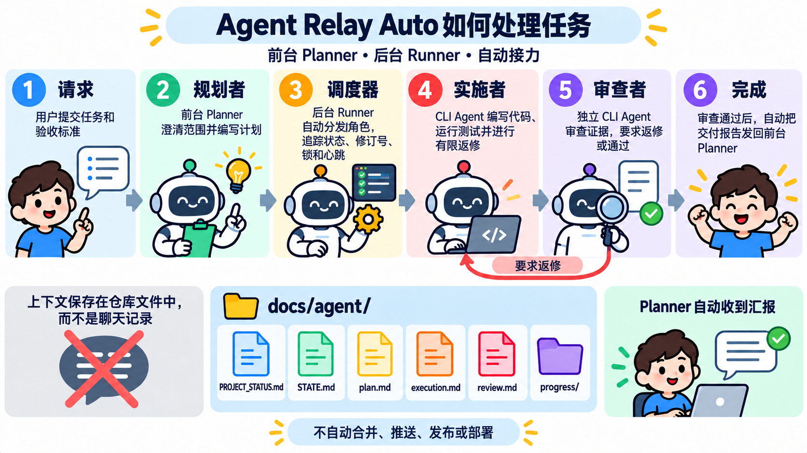

# Agent Relay Auto

> 面向 Codex、OpenCode、Claude Code 等 Agent 的协议驱动型协作框架：让项目记忆可迁移，让任务接力可恢复，让交付闭环可自动运行。

[English](README.md) · [项目介绍](docs/PROJECT_INTRO.md) · [完整使用手册](docs/AGENT_RELAY_AUTO_USAGE.md) · [最新发行版](https://github.com/MJHuang666/agent-relay-auto/releases/latest)

## 简介

Agent Relay Auto 是一个轻量级多 Agent 接力协作框架，围绕同一个项目仓库实现可恢复、可审计的文件化协作。

Agent Relay Auto 不要求不同 Agent 共享同一个聊天上下文，而是让它们共享同一个项目状态。需求、计划、实施证据、审查结论、交接记录和最终报告都落在仓库文件中，因此 Agent、模型、电脑或对话窗口发生变化时，项目认知仍然可以被恢复。

自动模式下，用户只需要和前台 Planner 沟通。Runner 在后台领取并启动 Implementer、Reviewer；Reviewer 通过后，Runner 自动恢复最初登记的 Planner 对话，Planner 汇总交付结果并完成 DONE：

~~~text
用户 ↔ 前台 Planner
          │
          ▼
     生成需求与计划
          │
          ▼
后台 Runner ──► Implementer ──► Reviewer
     ▲                              │
     └──── 自动返修 / 自动重规划 ────┘
                                    │
                                    ▼
                         原 Planner 对话自动汇报
                                    │
                                    ▼
                                   DONE
~~~

REPORTING 不需要用户再次输入“继续”；默认项目轮询间隔为 45 秒。WAITING_USER、BLOCKED 和需求扩大仍然会回到前台，由用户做决定。

## 核心理念：项目认知不能跟着 Agent 消失

单个聊天窗口不是可靠的长期工程记录：上下文可能截断，模型可能更换，Agent 可能耗尽额度，电脑和环境也可能迁移。真正需要继承的内容必须归项目所有。

~~~text
临时聊天上下文                         项目级长期认知
一个窗口 · 一个模型 · 一台电脑   ──►   仓库文件 · Git 历史 · 可验证证据
                                             │
                                             ▼
                                  任意兼容 Agent 都可以接力恢复
~~~

## 三个稳定角色，工具自由组合

角色是稳定契约，工具只是可替换的执行载体。同一个工具可以承担多个角色，同一个角色也可以在不同工具之间安全切换。

| 角色 | 主要职责 | 明确边界 |
|---|---|---|
| **Planner / 规划者** | 澄清需求、定义范围和非目标、生成计划、记录决策、制定验收标准 | 不修改产品代码；需求歧义或范围扩大时请求用户决定 |
| **Implementer / 实施者** | 按计划修改代码、编写测试、记录实施证据，并处理 Reviewer 返修 | 不自行批准交付；实施前必须明确 USE 或 DO_NOT_USE 子代理策略 |
| **Reviewer / 审查者** | 独立检查需求、计划、代码差异、测试和交付证据，给出通过或返修结论 | 不直接修复产品代码；没有有效证据不能通过 |

标准自动闭环：

~~~text
Planner 生成 plan.md
    ↓
Runner 启动 Implementer
    ↓
Implementer 生成 execution.md + 测试证据
    ↓
Runner 启动 Reviewer
    ├─ PASS              → 原 Planner 自动汇报 → DONE
    ├─ CHANGES_REQUESTED → Implementer 自动返修 → 再次 Review
    ├─ REPLAN_REQUIRED   → Planner 回到前台重规划
    └─ BLOCKED / WAITING_USER → 等待用户处理
~~~

## 主要能力

| 能力 | 说明 |
|---|---|
| 文件化上下文 | docs/agent/ 是跨 Agent、跨模型、跨机器的共享认知层 |
| 自动接力 | 合法状态转换后由 Runner 自动领取下一角色，不依赖用户搬运上下文 |
| 原 Planner 自动汇报 | Reviewer 通过后恢复初始化时登记的 Planner 对话，不要求再次输入“继续” |
| 并发隔离 | 不同项目可以并行；同一项目第一版每次只运行一个活动任务和一个角色回合 |
| 安全交接 | task_id + revision + participant_id + lock 防止旧会话覆盖新状态 |
| 可恢复执行 | 中断、超时或 Runner 重启后从持久化状态、heartbeat 和 run 日志恢复 |
| 可审计交付 | Reviewer 证据、delivery ID、报告和最终状态都保存在任务目录 |
| 可更换 Agent | 支持同角色 A → B → A 多次来回切换，保留不可变 participant ID 和原因记录 |

## 支持的 Agent

初始化时会为每个角色选择一个稳定 Tool ID：

| 选项 | Tool ID | 自动模式说明 |
|---|---|---|
| Codex | codex | 支持后台实施、审查和 Planner 汇报 |
| Cursor | cursor | 支持文件协议接力；本版本不用于原 Planner 自动唤醒 |
| Claude Code | claude-code | 支持非交互后台适配器，首次启动需验证凭证和模型 |
| WorkBuddy | workbuddy | 文件协议接力 |
| ZCode | zcode | 文件协议接力 |
| Trae | trae | 文件协议接力 |
| DeepSeek Harness | deepseek-harness | Planner 唤醒能力按 static_only / experimental 如实标记 |
| OpenCode | opencode | 支持非交互后台适配器和 Planner 汇报，首次启动需验证 |
| Other | 用户自定义稳定 ID | 按能力降级到手动模式 |

OpenCode 和 DeepSeek Harness 复用根目录 AGENTS.md、.agents/skills/agent-relay-auto/ 与 docs/agent/，不创建 .opencode/skills 或 .dsh/skills 重复协议副本。

## 从零初始化到自动运行

### 0. 准备环境

- 在目标项目根目录执行初始化；不要在父目录或 Skill 源码目录初始化。
- 建议使用 Git，以便绑定交付版本和审查差异。
- Python 3 用于短时文件锁、revision-CAS 和原子写入保护；没有 Python 3 仍可手动串行接力，但会降级并明确提示。
- 自动 Runner 当前使用 macOS launchd；CLI Agent 的登录、凭证和模型必须先在本机可用。

### 1. 安装 Skill

任选一种方式：

1. 安装个人 Skill：把发行包中的 shared/.agents/skills/agent-relay-auto/ 安装到当前工具的个人 Skills 目录。
2. 从 GitHub Releases 下载 Skill 包，并按 distribution/INSTALL.md 合并到目标工具。

安装成功后，在目标项目的 Planner 对话中执行下一步命令。Skill 会在初始化时复制项目级模板和共享协议；不需要手工寻找或配置“Adapter factory”。

### 2. 初始化当前仓库

在目标仓库根目录打开 Planner 对话，输入：

~~~text
$agent-relay-auto 初始化当前仓库
# 或
$agent-relay-auto initialize this repository
~~~

初始化只补齐缺失文件，不覆盖已有产品代码、任务记录、角色绑定或项目规则。

### 3. 先选项目语言

Skill 首先询问：

1. 中文（zh-CN）
2. English（en-US）

这个选择会写入 docs/agent/PROJECT_STATUS.md，并决定后续选项、需求、计划、执行记录、审查报告和验收报告的语言。协议字段名和状态枚举保持稳定，不会被翻译。

### 4. 为三个角色选择 Agent 和身份

依次选择 Planner、Implementer、Reviewer 的 Agent，并为每个角色确认唯一 participant_id。可以三个角色都使用 Codex，也可以混用 Codex、OpenCode、Claude Code 等工具。

初始化会显示当前配置（如果已有配置），让你选择“确认”或“修改”。不会因为当前打开的是某个工具，就擅自推断角色身份。

### 5. 配置模型、推理参数和自动策略

对每个角色，Skill 会通过对话确认：

- participant_id
- Agent Tool ID
- 模型 ID
- 工具专用推理参数：Codex 使用 reasoning_effort，OpenCode 使用 variant，Claude Code 使用 effort

初始化时同时展示自动策略默认值，减少误填：

| 配置 | 默认值 |
|---|---:|
| 最大返修轮数 | 3 |
| 最大自动重规划次数 | 1 |
| Agent 失败重试 | 1 |
| 同角色备用 Agent 自动切换 | 关闭 |
| 成本控制 | balanced（第 8 次 run 提醒，第 12 次停止新的 run） |

配置不完整、模型仍为占位值、Agent 不支持后台自动运行或 Planner 对话未登记时，Runner 不会启动；Skill 会在对话中指出具体缺项并引导修复。

### 6. 单独确认是否安装并启动 Runner

三角色配置完成后，Skill 会再次展示完整摘要，并单独询问：是否安装并启动本项目的 Runner。

- 选择“不安装”：项目保持 manual，继续使用文件化手动接力。
- 选择“安装并启动”：Skill 检查 ready_to_start: true，安装版本化 Runner，注册当前项目并启动 macOS launchd 服务。

Runner 使用初始化时登记的 Planner 对话作为唯一汇报入口。登记信息写入被忽略的 .agent-relay-auto/planner-channel.json，状态输出只展示遮罩后的对话 ID。

### 7. 验证自动化已进入工作状态

在 Planner 对话中检查：

~~~text
$agent-relay-auto Runner 状态
# 或
$agent-relay-auto runner status
~~~

确认项目状态为已注册、配置完整、服务已加载。需要排查时使用：

~~~text
$agent-relay-auto 查看日志
$agent-relay-auto 跟踪日志
~~~

运行日志、heartbeat、stdout/stderr、退出记录和协议事件位于目标项目的：

~~~text
.agent-relay-auto/runs/<TASK-ID>/<RUN-ID>/
~~~

该目录必须加入 .gitignore，不会成为项目交付的一部分。

## 初始化之后，怎样真正进入自动化

初始化和 Runner 启动完成后，用户不需要分别打开 Implementer 和 Reviewer，也不需要手工复制计划。直接回到原 Planner 对话，用自然语言布置任务：

~~~text
请实现一个用户登录功能，要求：
1. 支持邮箱和密码登录；
2. 增加单元测试；
3. 不修改现有数据库迁移；
4. 验收以测试通过和 Reviewer 独立审查为准。
~~~

Planner 会：

1. 澄清需求、非目标和验收条件；
2. 写入 requirement.md、plan.md 和任务 STATE.md；
3. 如需子代理，先让用户选择 USE 或 DO_NOT_USE；
4. 合法交接给 Runner。

之后 Runner 自动完成：

1. 领取 Implementer 回合并注入任务、角色、模型和运行配置；
2. 读取实施证据，必要时按上限自动返修；
3. 启动独立 Reviewer，要求有效测试和审查证据；
4. Reviewer 通过后恢复原 Planner 对话；
5. Planner 自动读取 review.md、delivery evidence 和进度文件，输出最终汇报并完成 DONE。

用户只会在需要决策、范围扩大、凭证/权限问题、达到策略上限或进入 BLOCKED 时被打断。Planner 窗口最小化或切换到其他应用不会停止后台 Implementer、Reviewer 和 Runner。

## 手动模式与自动模式

| 项目 | 手动模式 | 自动模式 |
|---|---|---|
| Planner | 前台沟通 | 前台沟通 |
| Implementer / Reviewer | 用户打开对应工具并输入“继续” | Runner 后台自动启动 |
| 最终汇报 | 用户回到 Planner 输入“继续” | Runner 自动恢复原 Planner 对话 |
| 适合场景 | 未安装 Runner、工具不支持 CLI 或调试 | 已完成配置并希望减少人工搬运 |
| 共同边界 | 都依赖仓库状态；都不自动 merge、push、release、deploy | 同左 |

手动接力命令：

~~~text
$agent-relay-auto 继续
$agent-relay-auto continue
~~~

自动 Runner 管理命令：

~~~text
$agent-relay-auto Runner 状态
$agent-relay-auto 启动 Runner
$agent-relay-auto 停止 Runner
$agent-relay-auto 重启 Runner
$agent-relay-auto 查看日志
$agent-relay-auto 跟踪日志
$agent-relay-auto 暂停当前任务
$agent-relay-auto 立即中断当前角色
$agent-relay-auto 恢复当前任务
~~~

## 项目状态目录

~~~text
docs/agent/
├── PROJECT_STATUS.md       # 项目入口、活动任务、语言和当前阶段
├── knowledge-index.md      # 已验证、可跨任务复用的项目认知
├── role-bindings.md        # 稳定角色和 participant_id 绑定
├── profiles/               # 各 Agent 的角色 Profile
└── tasks/<TASK-ID>/
    ├── STATE.md            # 唯一实时状态源
    ├── requirement.md      # 需求、范围、非目标、验收标准
    ├── plan.md             # Planner 计划与决策
    ├── execution.md        # Implementer 实施、测试和 delivery evidence
    ├── review.md           # Reviewer 独立结论和返修要求
    ├── decisions.md        # 需要长期保留的任务决策
    └── progress/            # 追加式阶段记录
~~~

Runner 的运行态与日志不进入 docs/agent/，而在被忽略的 .agent-relay-auto/ 下保存。项目级状态属于仓库；机器级 Runner 服务只是执行器，不是认知的唯一来源。

## 安全边界

- DONE 只代表 Reviewer 证据有效、Planner 汇报完成和需求验收通过。
- DONE 不代表自动合并、推送、发布、部署、生产写入、删除或回滚。
- Runner 只执行合法状态转换，不从自然语言猜测 Reviewer verdict，也不直接写 DONE。
- 锁和 revision 保护同一 checkout 的协调状态，不是权限系统，也不协调多台机器。
- 旧 Agent 和新 Agent 可以多次 A → B → A 切换；每次更换都保留原因、授权、范围和 revision 记录。
- 密钥、凭证、需求歧义、范围扩大和高风险外部操作必须回到用户处理。

## 项目目录

~~~text
.agents/skills/agent-relay-auto/   共享 Skill、协议和状态安全脚本
codex/                             Codex 入口和提示文件
cursor/                            Cursor 入口和提示文件
shared/docs/agent/                 初始化模板、协议和角色 Profile
docs/                              双语说明、使用手册、验证报告和流程图
compat/                            旧命令名兼容入口
distribution/                      安装说明和发行包元数据
~~~

## 验证、升级和贡献

发行等价校验：

~~~bash
bash .github/scripts/validate-release.sh
~~~

升级已有项目时，只同步 Skill、协议和缺失模板；不要覆盖目标项目自己的 PROJECT_STATUS.md、角色绑定、Profile、任务记录或架构约束。完整升级流程见 [中文使用手册](docs/AGENT_RELAY_AUTO_USAGE.md)、[英文使用手册](docs/AGENT_RELAY_AUTO_USAGE.en-US.md)、[安装说明](distribution/INSTALL.md) 和 [变更记录](CHANGELOG.md)。

欢迎通过 Issue 或 Pull Request 参与改进。请先阅读 [CONTRIBUTING.md](CONTRIBUTING.md)、[SECURITY.md](SECURITY.md) 和 [CODE_OF_CONDUCT.md](CODE_OF_CONDUCT.md)。本项目使用 [Apache-2.0](LICENSE) 许可证。
